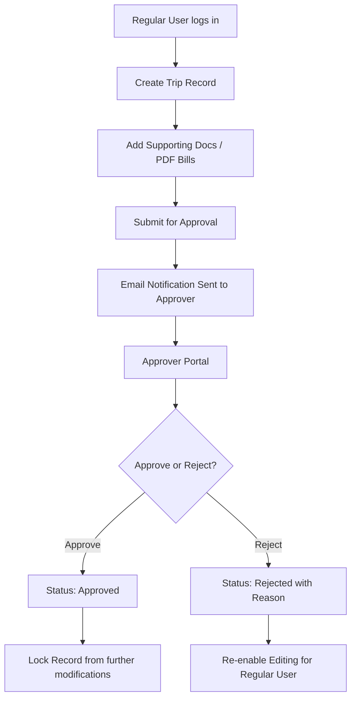

# Trip Manager - CRUD Application Documentation

This document explains the architecture, functionality, database schema, and design patterns of the **Trip Manager & Approval System** (located in the `/crud-app` directory). It excludes any references to the product management application.

---

## 1. System Overview

The **Trip Manager** is a Node.js/Express web application that enables users to record trips, attach supporting documents (e.g., invoices/bills in PDF format), submit them for approval, and allows authorized approvers to approve or reject them. 

### Key Characteristics:
- **No External Storage Dependencies**: File attachments are stored directly inside the database as binary data (`BYTEA`). Previously, the application had integration with SharePoint, which has been removed.
- **Email Notifications**: Generates styled HTML emails to notify approvers when trips are submitted or acted upon.
- **Session & Security Enforcement**: Includes password hashing (bcrypt), session state control, and active session concurrency checks (preventing double logins under the same username).

---

## 2. Technology Stack

- **Backend**: Node.js, Express.js (REST APIs)
- **Database**: PostgreSQL (via `pg` pool connector)
- **Authentication**: `express-session` for session tracking, `bcryptjs` for secure password verification
- **File Uploads**: `multer` middleware (configured to intercept uploads to memory storage)
- **Email System**: `nodemailer` (SMTP mail client)
- **Frontend**: Vanilla JavaScript (ES6+), HTML5, CSS3

---

## 3. User Roles & Authorization Flow

The application enforces Role-Based Access Control (RBAC) via express middleware. There are three roles defined within the database `admin_users` table:

1. **Regular User (`guser`)**:
   - Authorized to create, view, modify, and delete their own trip records.
   - Can upload, modify, and delete supporting documents.
   - Can submit trips for approval.
   - *Restriction*: Cannot edit or delete a trip once it has been submitted for approval or approved.

2. **Admin User (`admin`)**:
   - Authorized to view all trips in the system.
   - Can manage and modify records, but typically functions as an administrative overseer.

3. **Approver User (`approver`)**:
   - Authorized to view all trips and access the dedicated Approver Portal.
   - Can approve or reject pending trips.
   - *Restriction*: Cannot create or modify trip records directly (preventing conflicts of interest).

### Authentication & Session Middleware:
- **`requireAuth`**: Validates that a user session exists.
- **`requireRegularUser`**: Blocks users with the `approver` or `admin` role from executing write/update requests meant for regular users.
- **`requireApprover`**: Restricts access to endpoints like `/api/trips/:invoice/approve` or `/api/trips/:invoice/reject` to approvers only.
- **Active Session Enforcement**: During login, the server queries the `active_sessions` table. If the username is already logged in elsewhere, it rejects the new session to prevent concurrency conflicts.

---

## 4. Core Functional Workflows

### A. Trip Lifecycle & Status
- **Pending (Default)**: Created trips start in `pending` status. Supporting documents can be uploaded, and the trip details can be modified.
- **Submitted for Approval**: The regular user locks the trip and submits it. This action triggers an HTML notification email using Nodemailer, which contains a table of details and a link to the approver portal.
- **Approved**: Once approved by an approver, the trip status is set to `approved`. The trip is permanently locked against modifications or deletions.
- **Rejected**: If rejected, the approver specifies a rejection reason. The trip goes back to `rejected` status, allowing the regular user to edit details, replace files, and re-submit.

### B. Document Management
Each trip can have multiple supporting documents linked by the trip's `yantriki_invoice_number`.
- Documents carry metadata: invoice date, category, description, bill ID, bill amount, and page number.
- Files are verified to be PDF format, with a size limit of **10MB**.
- The binary content of the PDF is written directly to the database `file_content` (`BYTEA`) column. Users can download them directly from the web client.

---

## 5. Database Schema

The system initializes and updates five database tables during startup:

### 1. `trips`
Stores the metadata for every recorded trip.

| Column | Type | Description |
| :--- | :--- | :--- |
| `yantriki_invoice_number` | `TEXT` (PK) | Primary Key; unique invoice identifier. |
| `customer_name` | `TEXT` | Name of the customer. |
| `customer_location` | `TEXT` | Location of the customer. |
| `po_order` | `TEXT` | Purchase Order identifier. |
| `po_date` | `TEXT` | Purchase Order date. |
| `traveller_name` | `TEXT` | Name of the employee travelling. |
| `travel_route` | `TEXT` | Trip origin, stops, and destination. |
| `wo_number` | `TEXT` | Work Order number. |
| `wo_date` | `TEXT` | Work Order date. |
| `travel_start_date` | `TEXT` | Date trip commenced. |
| `travel_end_date` | `TEXT` | Date trip concluded. |
| `status` | `TEXT` | Current status (`pending`, `approved`, `rejected`). |
| `submitted_for_approval` | `BOOLEAN` | True if the trip is submitted to the approvers. |
| `rejection_reason` | `TEXT` | Reason provided if the trip is rejected. |
| `approved_by` | `TEXT` | Username of the approver. |
| `approved_date` | `TIMESTAMPTZ` | Timestamp when the action was taken. |
| `created_by` / `created_date` | `TEXT` / `TIMESTAMPTZ` | Audit columns tracking creator and creation time. |
| `updated_by` / `updated_date` | `TEXT` / `TIMESTAMPTZ` | Audit columns tracking last editor and update time. |
| `deleted_by` / `deleted_date` | `TEXT` / `TIMESTAMPTZ` | Used for soft deletion of records. |

### 2. `supporting_docs`
Stores attachments and metadata for claim bills linked to a trip.

| Column | Type | Description |
| :--- | :--- | :--- |
| `id` | `SERIAL` (PK) | Auto-incrementing identifier. |
| `trip_invoice_number` | `TEXT` (FK) | Reference to `trips(yantriki_invoice_number)`. |
| `doc_date` | `TEXT` | Date on the document. |
| `description` | `TEXT` | Summary of the bill. |
| `bill_id` | `TEXT` | Invoice/receipt number of the bill. |
| `category` | `TEXT` | Travel expense category (e.g., Food, Lodging, Transit). |
| `bill_amount` | `NUMERIC(12,2)` | Amount claimed on this bill. |
| `page_no` | `INTEGER` | Page ordering in compilation. |
| `file_name` | `TEXT` | Name of the uploaded PDF file. |
| `file_type` | `TEXT` | MIME type (must be `application/pdf`). |
| `file_content` | `BYTEA` | Binary stream of the file itself. |
| `created_by` / `created_date` | `TEXT` / `TIMESTAMPTZ` | Audit columns. |

### 3. `admin_users`
Stores user authentication details and roles.

| Column | Type | Description |
| :--- | :--- | :--- |
| `username` | `TEXT` (PK) | Log-in username. |
| `password_hash` | `TEXT` | Bcrypt-hashed password. |
| `role` | `TEXT` | Access level (`admin`, `approver`, `guser`). |

### 4. `active_sessions`
Tracks active logins to enforce single-session concurrency rules.

| Column | Type | Description |
| :--- | :--- | :--- |
| `username` | `TEXT` (PK) | Username of the logged-in user. |
| `session_id` | `TEXT` | ID of the active Express session. |

---

## 6. API Endpoints Map

### Authentication
- `POST /api/auth/login` - Auths the user and registers session (auto-hashes plain passwords on the fly if stored raw).
- `POST /api/auth/logout` - Destroys the active session and clears the concurrency table.
- `GET /api/auth/me` - Resolves details of the currently authenticated session.

### Trip Management
- `GET /api/trips` - Lists trips with pagination (scoped to creator if user is a `guser`).
- `GET /api/trips/pending` - Lists all trips awaiting approval (approver access required).
- `GET /api/trips/search?keyword=...` - Queries across invoice numbers, traveller names, routes, etc.
- `GET /api/trips/:invoice` - Retrieves details of a single trip.
- `POST /api/trips` - Registers a new trip (regular user only).
- `PUT /api/trips/:invoice` - Updates trip details (restricted if approved or submitted).
- `DELETE /api/trips/:invoice` - Performs a soft delete (restricted if approved or submitted).
- `POST /api/trips/:invoice/submit-approval` - Locks the record, sets status to pending review, and fires notifications.

### Supporting Document Operations
- `GET /api/trips/:invoice/documents` - Fetches metadata of all attached bills for a trip.
- `GET /api/trips/:invoice/documents/total` - Aggregates the sum of all claim amounts.
- `GET /api/trips/:invoice/documents/maxpage` - Computes the maximum page number used.
- `POST /api/trips/:invoice/documents` - Uploads a PDF bill with metadata (restricted if approved or submitted).
- `PUT /api/trips/:invoice/documents/:id` - Updates metadata or file content of a specific bill attachment.
- `DELETE /api/trips/:invoice/documents/:id` - Removes a document and its binary content from the database.
- `GET /api/trips/:invoice/documents/:id/file` - Downloads the binary PDF attachment.

### Workflow Controls
- `POST /api/trips/:invoice/approve` - Marks trip as approved and logs the reviewer details.
- `POST /api/trips/:invoice/reject` - Rejects the trip, logs the reviewer, and records the reason.
